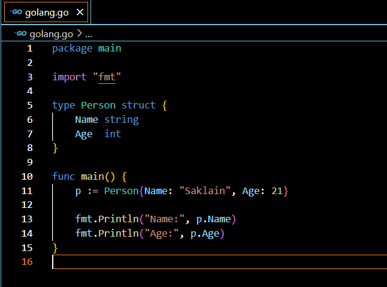

# Go (Golang) Documentation

## Introduction

Go (also known as Golang) is a programming language made by Google. It is meant to be simple, fast, and able to handle many things happening at once. This makes it good for making software that can grow and work well. Go has strong rules about how data is used, it cleans up unused data automatically, and it comes with lots of pre-made tools which makes it useful for lots of different things like making websites, working with your computer's system, and using cloud services.


## Installing Go on Windows
To install Go on a Windows operating system, follow these steps:

1. **Download Go Installer**: Visit the official [Go Downloads](https://golang.org/dl/) page and download the latest version of the Go installer for Windows.

2. **Run Installer**: Once the installer is downloaded, double-click on the executable file to start the installation process.

3. **Follow Installation Guide**: Follow the instructions provided during the installation process`. You can choose the default settings or customize the installation directory as needed.

4. **Verify Installation**: After the installation is complete, open a command prompt and type `go version` to verify that Go has been installed successfully. You should see the installed version of Go displayed in the output.


## Installing Visual Studio Code

Visual Studio Code (VS Code) is a popular open-source code editor developed by Microsoft. It provides a lightweight and customizable environment for writing code in various programming languages, including Go.

To install Visual Studio Code on Windows:

1. **Download VS Code Installer**: Visit the official [Visual Studio Code](https://code.visualstudio.com/) website and download the latest version of the VS Code installer for Windows.

2. **Run Installer**: Double click on the downloaded file to start the installation process.

3. **Follow Installation Guide**: Follow the instructions provided by the installation Guide. You can choose the default settings or customize the installation directory as needed.

4. **Launch Visual Studio Code**: Once the installation is complete, launch Visual Studio Code from the Start menu or desktop shortcut.


## Installing VS Code Tools for Go

To make coding in the Go programming language easier and more effective within Visual Studio Code, you can install go extensions.
To install the Go extension in Visual Studio Code:

1. **Open Extensions View**: In Visual Studio Code, press `Ctrl+Shift+X` or click on the Extensions icon in the Activity Bar on the side of the window.

2. **Search for Go Extension**: In the Extensions view, search for "Go" in the search bar.

3. **Install Go Extension**: Locate the "Go" extension published by the Go Team at Google and click on the Install button.

4. **Reload Visual Studio Code**: After the installation is complete, reload Visual Studio Code to activate the Go extension.


## Hello World Program

Now that you have installed Go and Visual Studio Code, let's create a simple "Hello World!" program in Go:

```go
package main

import "fmt"

func main() {
    fmt.Println("Hello World!")
}
```


Save the above code to a file named `golang.go`. You can use Visual Studio Code or any text editor of your choice.

To run the program, open a command prompt (or you can even open the terminal in vs code), navigate to the directory containing `golang.go`, and run the following command:

```
go run golang.go
```

You should see the output `Hello World!` printed to the terminal.

 

 


## Structure of a Go Program

A Go program typically consists of one or more source files containing Go code. Each source file starts with a package declaration followed by import statements and function definitions. Here's the basic structure of a Go program:

```go
package main

import "fmt"

// Function definition
func main() {
    // Code goes here
    fmt.Println("Hello World!")
}
```

- **Package Declaration**: Every Go file starts with a package declaration. The `main` package is used for executable programs, and the `package main` declaration indicates that this file will be compiled into an executable program.

- **Import Statements**: The `import "fmt"` statement in the program brings in a toolkit called `fmt`, which helps with printing things out nicely on the screen. It's like bringing in a set of tools from a toolbox to do a specific job in this case, printing text.
- **Function Definition**: The `main` function is the entry point of a Go program. It is called automatically when the program starts and serves as the starting point for execution. All executable Go programs must contain a `main` function.


### Local Variables:
Local variables are declared within a specific block of code, such as a function, and their scope is limited to that block. They are only accessible within the block where they are declared.

**Example:**
```go
package main

import "fmt"

func main() {
    // Declaring and initializing a local variable
    var x int = 10

    // Accessing the local variable
    fmt.Println("Local variable x:", x)
}
```

In this example, `x` is a local variable within the `main` function. It's declared and initialized with a value of `10`. It's accessible only within the `main` function.

Summary - Local variables are declared within a block of code (e.g., function) and have limited scope

 


### Package Variables:
Package variables (also known as global variables) are declared outside of any function and can be accessed from any file within the same package. They have package-level scope.

**Example:**
```go
package main

import "fmt"

// Declaring a package variable
var globalVar int = 20

func main() {
    // Accessing the package variable
    fmt.Println("Package variable globalVar:", globalVar)
}
```

In this example, `globalVar` is a package variable declared outside of any function. It can be accessed from any function within the `main` package.

Summary - Package variables (global variables) are declared outside of any function and have package-level scope.

 

 

### Dot Notation in Go:
Dot notation in Go is used to access fields or methods of a struct type. It allows you to access the members of a struct using the dot (`.`) operator.

**Example:**
```go
package main

import "fmt"

// Define a struct type
type Person struct {
    Name string
    Age  int
}

func main() {
    // Creating an instance of the Person struct
    p := Person{Name: "Saklain", Age: 21}

    // Accessing fields using dot notation
    fmt.Println("Name:", p.Name)
    fmt.Println("Age:", p.Age)
}
```




In this example, we define a `Person` struct with two fields: `Name` and `Age`. We then create an instance of this struct and access its fields using dot notation.

Summary - Dot notation is used to access fields or methods of a struct type.


## Comments
Comments in Go are textual annotations within the source code that are ignored by the compiler. They serve as a means to document the code for better understanding and maintenance. Go supports two types of comments:

### Single-Line Comments
Single-line comments begin with "//" and continue until the end of the line.

```go
// This is a single-line comment
fmt.Println("Hello, World!")
```


### Multi-Line Comments
Multi-line comments start with "/*" and end with "*/". They can span across multiple lines.

```go
/*
This is a multi-line comment
It can span across multiple lines
*/
fmt.Println("Hello, World!")
```


## Variables
Variables in Go are used to store data that can be manipulated or accessed during the program's execution. They must be declared before use. Go supports various types of variables, including integers, floats, strings, booleans, and complex numbers.

### Variable Declaration
Variables in Go are declared using the "var" keyword followed by the variable name and type.

```go
var x int
var name string
```

### Variable Initialization
Variables can be initialized during declaration.

```go
var x int = 10
var name string = "Saklain"
```

### Short Variable Declaration
A shorter way to declare and initialize variables is by using the ":=" operator.

```go
x := 10
name := "Saklain"
```

### Example Program: Variables
```go
package main

import "fmt"

func main() {
    var x int
    x = 10

    var name string
    name = "Saklain"

    y := 20
    age := 22

    fmt.Println("x =", x)
    fmt.Println("name =", name)
    fmt.Println("y =", y)
    fmt.Println("age =", age)
}
```

### Output
```
x = 10
name = Saklain
y = 20
age = 22
```


## Constants
Constants are like variables, except that once declared, their value cannot be changed. They are declared using the "const" keyword.

### Constant Declaration
Constants in Go are declared using the "const" keyword followed by the constant name and value.

```go
const pi = 3.14
const degree = 9.8
```

### Example Program: Constants
```go
package main

import "fmt"

func main() {
    const pi = 3.14
    const gravity = 9.8

    fmt.Println("Pi =", pi)
    fmt.Println("Degree =", degree)
}
```

### Output
```
Pi = 3.14
Degree = 9.8
```


## Outputs
In Go, the "fmt" package is used to provide input and output functionality. The "Println" function is commonly used to print output to the console.

### Example Program: Output
```go
package main

import "fmt"

func main() {
    fmt.Println("Hello, World!")
}
```

### Output
```
Hello, World!
```


## Operators
Operators in Go are symbols that perform operations on operands. Go supports various types of operators, including arithmetic, relational, logical, assignment, and bitwise operators.

### Arithmetic Operators
Arithmetic operators are used to perform mathematical operations.

```go
+, -, *, /, %
```

### Example Program: Arithmetic Operators
```go
package main

import "fmt"

func main() {
    x := 10
    y := 5

    fmt.Println("x + y =", x+y)
    fmt.Println("x - y =", x-y)
    fmt.Println("x * y =", x*y)
    fmt.Println("x / y =", x/y)
    fmt.Println("x % y =", x%y)
}
```

### Output
```
x + y = 15
x - y = 5
x * y = 50
x / y = 2
x % y = 0
```


### Relational Operators
Relational operators are used to compare values.

```go
==, !=, <, >, <=, >=
```

### Logical Operators
Logical operators are used to perform logical operations.

```go
&&, ||, !
```

### Assignment Operators
Assignment operators are used to assign values to variables.

```go
=, +=, -=, *=, /=, %=
```

### Bitwise Operators
Bitwise operators are used to perform bitwise operations.

```go
&, |, ^, <<, >>
```

## Conditions
Conditions in Go are used to make decisions based on certain conditions. Go provides "if", "else if", and "else" statements for conditional execution.

### Example Program: Conditions
```go
package main

import "fmt"

func main() {
    x := 10

    if x > 5 {
        fmt.Println("x is greater than 5")
    } else if x < 5 {
        fmt.Println("x is less than 5")
    } else {
        fmt.Println("x is equal to 5")
    }
}
```

### Output
```
x is greater than 5
```


